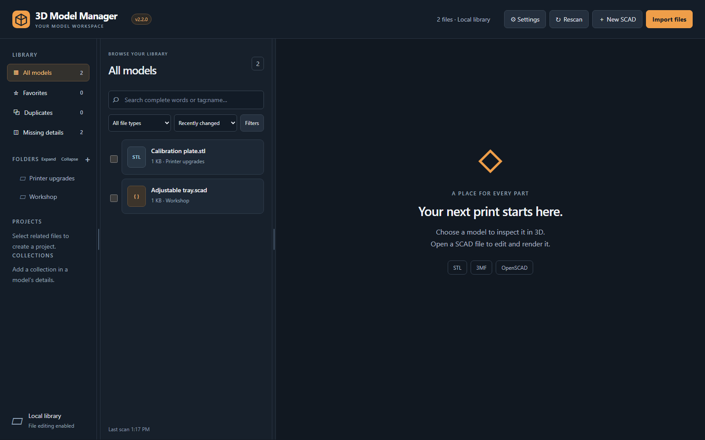

# 3D Model Manager

3D Model Manager is a self-hosted library for STL, 3MF, and OpenSCAD files. It connects directly to SMB2/SMB3 shares, leaving model files on the NAS while the searchable catalog, encrypted credentials, covers, print history, and backups live in the container's data folder.

## Screenshots

### Model viewer

### OpenSCAD editor and Customizer

## Highlights

- Interactive STL and 3MF viewer with automatic and custom thumbnails.
- Convert STL files to 3MF while embedding available model metadata and README details, with the option to keep or remove the original STL.
- OpenSCAD editor, Customizer parameters, dependency inspection, presets, rendering, and STL export.
- Direct SMB discovery and folder selection without host mount points.
- Whole-word and exact-tag search, advanced filters, and saved searches.
- Collections, tags, favorites, notes, projects, relationships, and print history.
- Hash-based duplicate detection and safe bulk operations.
- Restorable recycle bin and user-attributed activity history.
- Downloadable backup ZIPs containing metadata, settings, covers, photos, and recycled files.
- Optional administrator, editor, and read-only accounts.

## Quick start on Docker

~~~sh
mkdir -p ./data
DATA_HOST_PATH="$PWD/data" docker compose up -d --build
~~~

Open `http://YOUR-SERVER:3210`. The first-run guide will help connect a NAS share. Authentication is disabled until an administrator account is created and sign-in is explicitly enabled.

See [Installation](docs/INSTALLATION.md), [Upgrading and recovery](docs/UPGRADING.md), and [Troubleshooting](docs/TROUBLESHOOTING.md) for complete instructions, including Portainer.

## Storage and security

SMB credentials are encrypted with AES-256-GCM using a random key stored in `/data/.credential-key`. Passwords for app users are salted and hashed. Protect and back up the complete `/data` volume. Keep a separate backup of the model share itself.

The container runs as an unprivileged user, uses a read-only root filesystem, drops Linux capabilities, and does not require privileged mode. Do not expose the app directly to the public Internet; use a VPN or properly configured HTTPS reverse proxy.

## Development

Node.js 22 or newer and OpenSCAD are required.

~~~sh
npm ci
npm run build
npm test
npm start
~~~

Local development uses `LIBRARY_PATH` as a fallback filesystem library. Use disposable files when testing write operations.

## Project

- [Changelog](CHANGELOG.md)
- [Contributing](CONTRIBUTING.md)
- [Security policy](SECURITY.md)
- [Publishing releases](docs/PUBLISHING.md)
- [License](LICENSE)

3D Model Manager is released under the MIT License.
