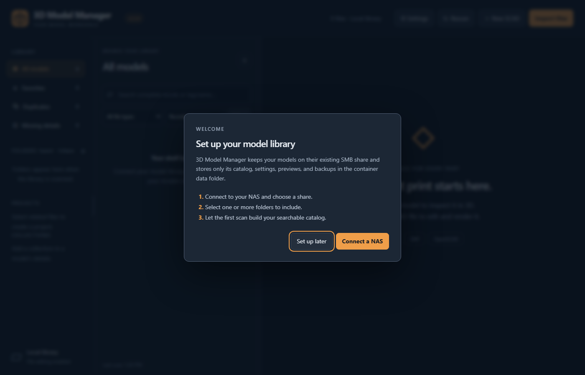
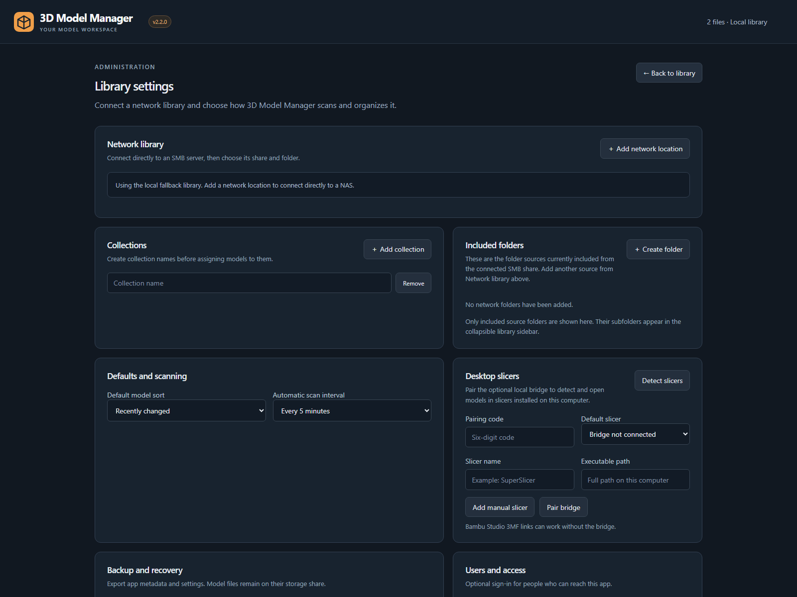

# Installation

## Requirements

- A Docker host with at least 2 GB of available memory.
- A persistent host folder for `/data`.
- Network access from the container to the SMB server on TCP port 445.
- An SMB2 or SMB3 account with access to the model share.

## Docker Compose

Clone or extract the repository, create the data folder, and start the included Compose stack:

```sh
mkdir -p ./data
DATA_HOST_PATH="$PWD/data" docker compose up -d --build
```

Open `http://DOCKER-HOST:3210` and follow the first-run guide. Use the NAS IP address if Docker cannot resolve its hostname.

## Portainer with a locally built image

On the Docker host, extract the release source and run:

```sh
chmod +x build-and-test-on-omv.sh
sudo DATA_HOST_PATH=/srv/appdata/3d-model-manager ./build-and-test-on-omv.sh
```

The script builds `3d-model-manager:local`, starts a temporary container, verifies its health endpoint, and leaves the tested image available to Portainer. Create a stack using `compose.portainer.yaml` and set `DATA_HOST_PATH` to the same persistent app-data folder.

## Published container image

After the project owner publishes a tagged GitHub release, replace the local image in the stack with:

```yaml
image: ghcr.io/OWNER/3d-model-manager:latest
```

Replace `OWNER` with the GitHub account or organization hosting the repository.

## Configuration

| Variable | Default | Purpose |
| --- | --- | --- |
| `DATA_HOST_PATH` | required | Host folder persisted as `/data` |
| `APP_PORT` | `3210` | Web interface port |
| `PUID` / `PGID` | `1000` | Host account that owns the data folder |
| `LIBRARY_WRITABLE` | `true` | Allows file creation, moves, edits, conversion, deletion, and restoration |
| `SCAN_INTERVAL_SECONDS` | `300` | Default library scan interval |
| `RENDER_TIMEOUT_SECONDS` | `120` | Maximum OpenSCAD render time |
| `MAX_FILE_MB` | `256` | Maximum previewed file size |

The application connects to NAS shares from its settings page. Do not add the model share as a Docker volume.

## First run

1. Choose **Connect a NAS**.
2. Select a discovered server or enter its IP address.
3. Enter the SMB credentials and select **Find shares**.
4. Choose a share and optionally browse to a folder.
5. Connect the library and allow the initial background scan to complete.
6. Add more folders from **Settings → Network library** if needed.
7. Optionally create an administrator under **Users and access**, then enable sign-in.





